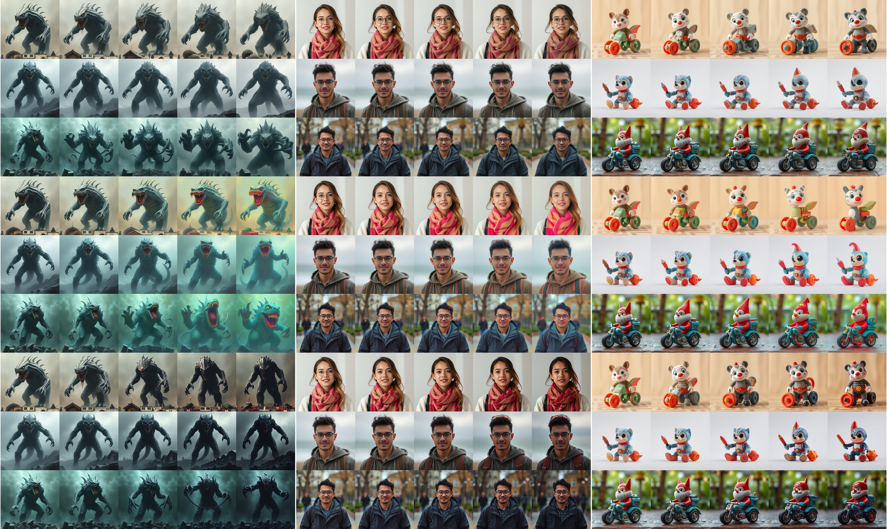

# SliderSpace Flux



A minimal (and very very hacky, unoptimized) implementation of [SliderSpace](https://arxiv.org/abs/2502.01639v1) that supports FLUX.1-schnell.

The scripts tested on 1xRTX6000-Ada 48GB.

**Tips** You can skip steps 2 & 3 by using pre-computed components in `./components`


### 1. Setup Dependencies
```bash
pip install -r requirements.txt
```

### 2. Generate Image Dataset
```bash
python gen.py "a picture of a toy" -N 5000 --num_steps 2
```
Takes ~15 mins on RTX 6000 Ada. Images save to: `./images/a_picture_of_a_toy`.

### 3. Process CLIP Embeddings & PCA
```bash
python clip_embed.py ./images/a_picture_of_a_toy --embed_output_dir ./embeddings/toy --pca_output_file ./components/toy_components.npy
```

This generates:
- CLIP embeddings `./embeddings/a_picture_of_a_toy`
- PCA components `./components/toy_components.npy`

Note: Pre-computed PCA components for car, monster, person, spaceship and toy are available in `./components`. 

Calculated from 5000 FLUX.1-schnell-generated images (256x256), using CLIP-B32 features.

### 4. Finetune LoRA
```bash
python train_flux_sliderspace.py \
    --pca_path ./components/toy_64_components.npy \ # use precomputed components
    --prompt "picture of a toy" \
    --output_dir ./output/toy \
    --num_train_steps 100 \
    --train_resolution 256 \
    --train_batchsize 4 \
    --component_ids "0,1,2,3,6,7,15,21" \
    --save_every 100 \
    --learning_rate 1e-4
```

This is a very short script. Training takes ~1.5 min per PCA component on an RTX 6000 Ada GPU with the above settings.

**Note**: This is an unofficial implementation and the settings may differ from the paper. Please refer to the [official implementation](https://github.com/rohitgandikota/sliderspace/) when it is released.

### 5. Inference

```python
from diffusers import FluxPipeline
import torch

pipe = FluxPipeline.from_pretrained("black-forest-labs/FLUX.1-schnell", torch_dtype=torch.bfloat16, device="cuda")
pipe.to("cuda")

prompt = "a picture of a toy" # Can use better prompts
component_ids = [0, 1, 2, 3]

# Same prompt and random seed, different LoRA
for pca_id in component_ids:
    pipe.load_lora_weights(f"./output/toy/component_{pca_id}_step_100")
    generator=torch.Generator("cuda").manual_seed(0)
    images = pipe(
        prompt, 
        guidance_scale=0.0,
        num_inference_steps=4,
        generator=generator,
        num_images_per_prompt=4,
        width=512,
        height=512
    ).images
    for idx, img in enumerate(images):
        img.save(f"./output/toy/component_{pca_id}_step_100_{idx}.png")
    
    pipe.unload_lora_weights(reset_to_overwritten_params=True)

# Or different LoRA strength

pca_id = 5
pipe.load_lora_weights(f"./output/toy/component_{pca_id}_step_100")
generator=torch.Generator("cuda").manual_seed(0)
for lora_scale in [0, 0.5, 1, 1.5, 2]:
    generator=torch.Generator("cuda").manual_seed(0)
    images = pipe(
        prompt,
        guidance_scale=0.0,
        num_inference_steps=4,
        generator=generator,
        num_images_per_prompt=4,
        width=512,
        height=512,
        joint_attention_kwargs={"scale": lora_scale} # adjust the strength here
    ).images
    for idx, img in enumerate(images):
        img.save(f"./output/toy/component_{pca_id}_step_100_{idx}_{int(lora_scale*10.):02d}.png")
        
pipe.unload_lora_weights(reset_to_overwritten_params=True)
```